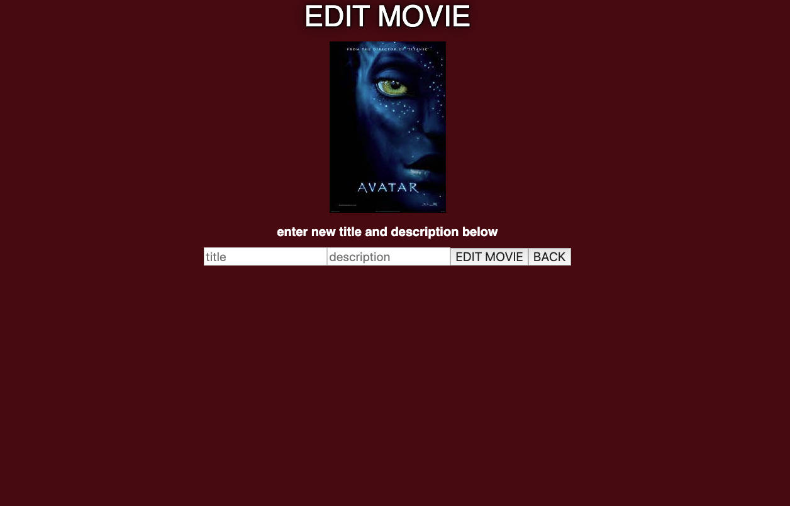
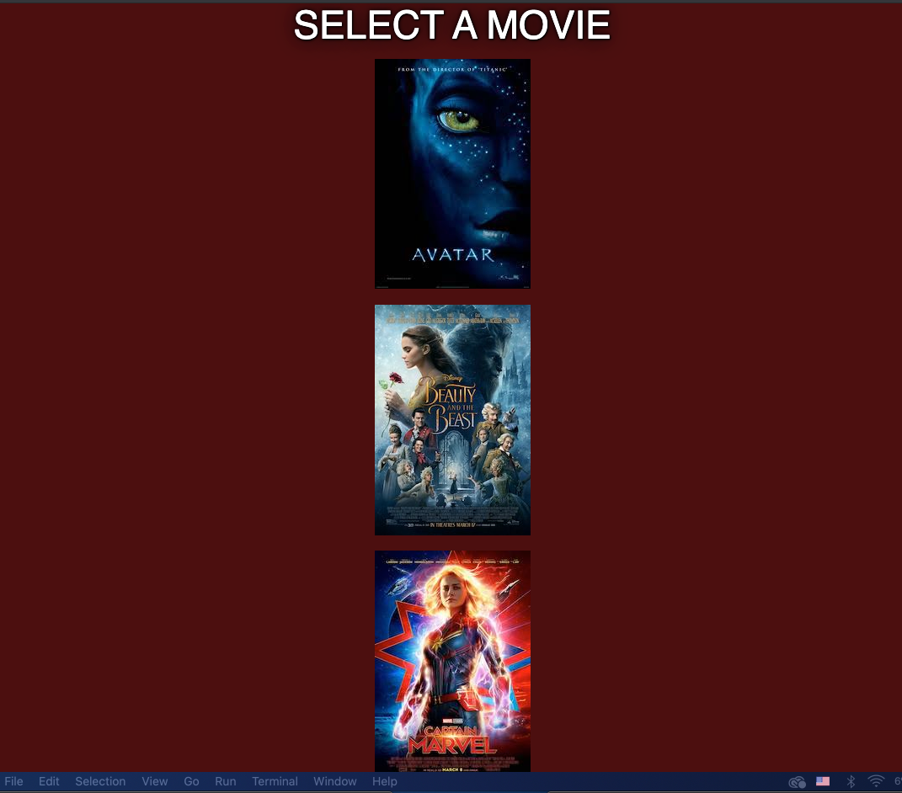
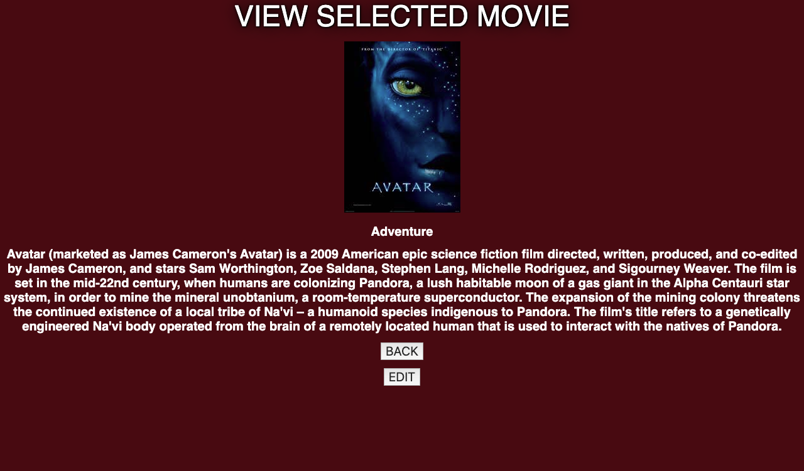

## Description
*Duration: 3 days*
MOVIE SAGA is an application where users can view movie information by clicking on a specific selected movie. users can view informationand edit them as they please.  
 
## Screen Shot

## Prerequisites
-none
 
 
## Installation
Installation
-make a database with the name of saga_movies_weekend, make a table using the information on database.sql and insert data into the tables. 
 -Clone this repository and run NPM install 
 -run npm run server/ npm run client once the repository is downloaded.

 
 
## Built With
-html5 
-css
-react
-Sagas
axios
-PostgreSQL
-Node.js
-Express.js
